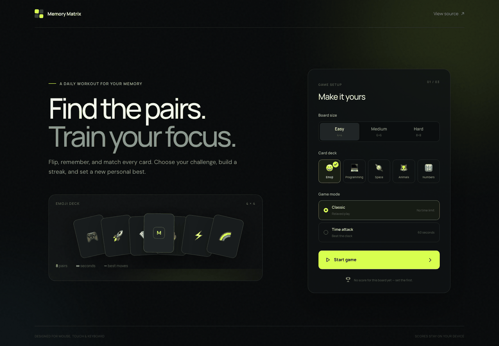
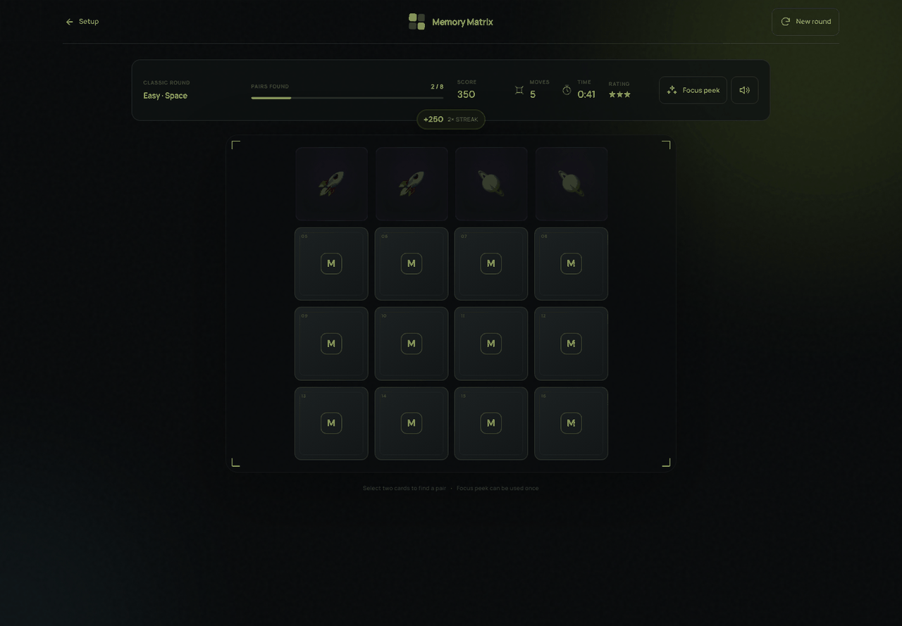
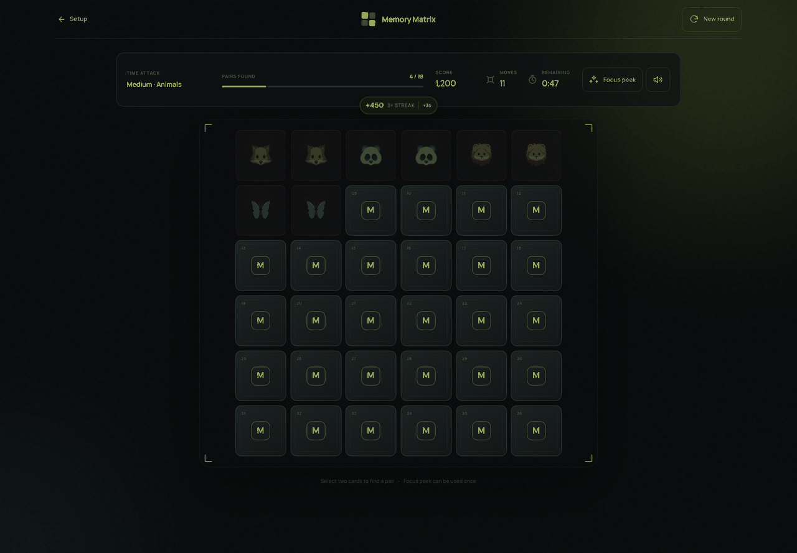
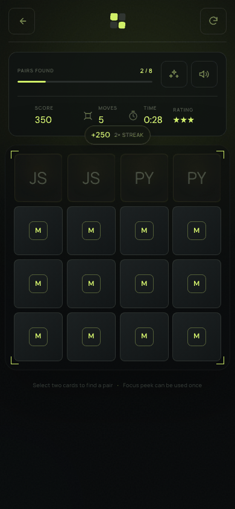
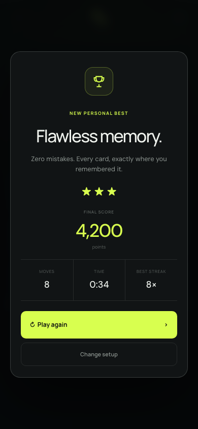
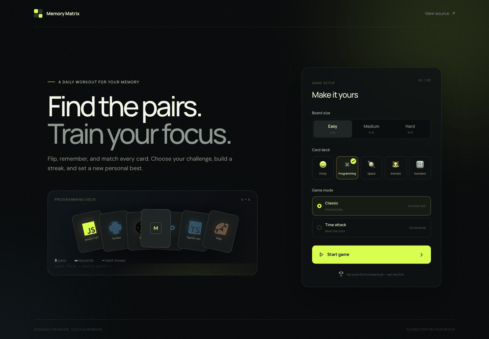
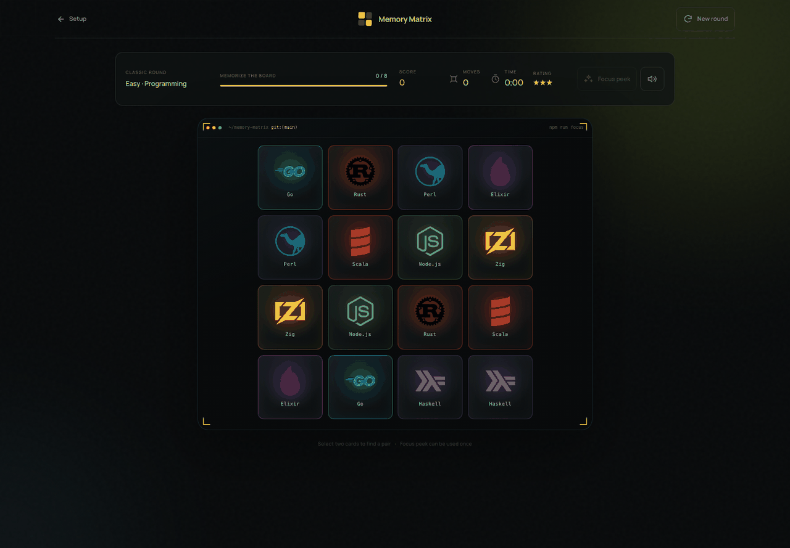
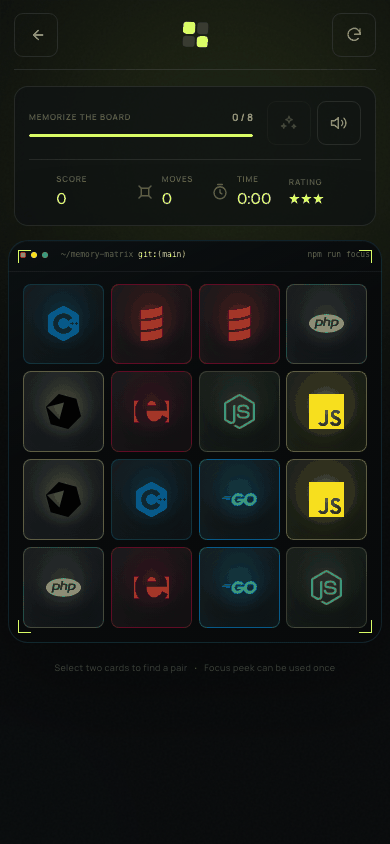

<div align="center">

# Memory Matrix

### A fast, polished memory game that rewards focus, speed, and streaks.

[](https://sanjays2402.github.io/memory-matrix/)
[](https://github.com/Sanjays2402/memory-matrix)
[](https://github.com/Sanjays2402/memory-matrix/actions/workflows/deploy.yml)

[Live game](https://sanjays2402.github.io/memory-matrix/) · [How to play](#how-to-play) · [Run locally](#run-locally) · [Report a bug](https://github.com/Sanjays2402/memory-matrix/issues/new)

</div>

## Screenshots

<p align="center">
  <a href="https://sanjays2402.github.io/memory-matrix/"></a>
</p>

<table>
  <tr>
    <td width="50%"></td>
    <td width="50%"></td>
  </tr>
  <tr>
    <td align="center"><strong>Classic mode</strong><br><sub>Chain matches and protect your streak.</sub></td>
    <td align="center"><strong>Time Attack</strong><br><sub>Match quickly to earn bonus seconds.</sub></td>
  </tr>
</table>

<table>
  <tr>
    <td width="50%" align="center"></td>
    <td width="50%" align="center"></td>
  </tr>
  <tr>
    <td align="center"><strong>Responsive play</strong><br><sub>The full game fits touch screens without horizontal overflow.</sub></td>
    <td align="center"><strong>Personal-best results</strong><br><sub>Review score, speed, moves, and best streak.</sub></td>
  </tr>
</table>

<table>
  <tr>
    <td width="33%"></td>
    <td width="33%"></td>
    <td width="33%"></td>
  </tr>
  <tr>
    <td align="center"><strong>Choose your stack</strong></td>
    <td align="center"><strong>Terminal-inspired play</strong></td>
    <td align="center"><strong>Real logos on mobile</strong></td>
  </tr>
</table>

---

## Why it is fun

Memory Matrix starts with familiar pair matching, then adds a light arcade layer:

- **Score every match** — clean matches earn points immediately.
- **Build streaks** — consecutive matches multiply the reward up to **1,250 points per pair**.
- **Race the clock** — Time Attack begins at 60 seconds and successful matches add **2–4 bonus seconds**, depending on board size.
- **Chase mastery** — improve your move count, finish time, star rating, and longest streak.
- **Choose your vibe** — play Emoji, Programming, Space, Animals, or Numbers decks.
- **Learn by sight** — the Programming deck uses 32 real, self-hosted technology logos instead of letter abbreviations.
- **Return every day** — everyone gets the same deterministic Daily Challenge, with a rotating deck and a persistent completion streak.
- **Use one Focus Peek** — reveal the board once when you are stuck; the trade-off is half points for the rest of that round.

## Game modes

| Mode | Goal | Twist |
|---|---|---|
| **Classic** | Clear the board efficiently | Earn up to three stars based on move count |
| **Time Attack** | Match as many pairs as possible before time expires | Every match adds bonus time |
| **Daily Challenge** | Complete the shared medium puzzle | A new deterministic board and rotating deck every UTC day |

## Boards and decks

| Difficulty | Grid | Pairs | Time bonus per match |
|---|---:|---:|---:|
| Easy | 4×4 | 8 | +2 seconds |
| Medium | 6×6 | 18 | +3 seconds |
| Hard | 8×8 | 32 | +4 seconds |

Five decks are included: **Emoji**, **Programming**, **Space**, **Animals**, and **Numbers**.

## How to play

1. Pick a board size, deck, and game mode.
2. Memorize the opening preview before the cards turn over.
3. Select two cards. A match stays revealed; a miss resets your streak.
4. Chain consecutive matches to increase your score multiplier.
5. Clear the board—or keep the Time Attack clock alive—to set a new personal best.

> **Tip:** The Focus Peek is powerful, but using it halves future point rewards for that round.

## Experience highlights

- Responsive 4×4, 6×6, and 8×8 boards
- Mouse, touch, and native keyboard controls
- Accessible labels, visible focus states, and reduced-motion support
- 3D card flips, match pulses, streak feedback, score popups, and confetti
- Synthesized Web Audio feedback with a one-tap mute control
- Local best scores with failure-safe `localStorage` access
- Near-black gameplay-first UI with a restrained acid-lime accent

## Built with

[](https://react.dev/)
[](https://vite.dev/)
[](https://tailwindcss.com/)
[](https://motion.dev/)
[](https://vitest.dev/)

## Run locally

```bash
git clone git@github.com:Sanjays2402/memory-matrix.git
cd memory-matrix
npm install
npm run dev
```

### Quality checks

```bash
npm run lint
npm test
npm run build
```

## Project structure

```text
src/
├── App.jsx                    # Screen flow and composition
├── gameLogic.js               # Decks, scoring, rewards, shuffle, storage
├── useGame.js                 # Round state, timers, streaks, and interactions
├── sounds.js                  # Web Audio feedback
├── index.css                  # Design system, layout, motion, responsive rules
└── components/
    ├── BackgroundOrbs.jsx     # Ambient canvas
    ├── Card.jsx               # Accessible 3D card
    ├── GameBoard.jsx          # Responsive board
    ├── Header.jsx             # HUD, rewards, hint, and sound controls
    ├── Icons.jsx              # Shared SVG icon set
    ├── Menu.jsx               # Game setup and deck preview
    └── VictoryOverlay.jsx     # Results, score, and replay flow
```

## Links

- **Play:** https://sanjays2402.github.io/memory-matrix/
- **Repository:** https://github.com/Sanjays2402/memory-matrix
- **Issues:** https://github.com/Sanjays2402/memory-matrix/issues
- **Deployments:** https://github.com/Sanjays2402/memory-matrix/actions/workflows/deploy.yml
- **License:** [MIT](LICENSE)

## Contributing

Ideas and fixes are welcome. Open an [issue](https://github.com/Sanjays2402/memory-matrix/issues/new) or submit a pull request with a focused change and passing quality checks.

## Asset credits

Programming deck logos are provided by [Simple Icons](https://simpleicons.org/) under
[CC0 1.0](https://github.com/simple-icons/simple-icons/blob/develop/LICENSE.md) and
stored locally for reliable, privacy-friendly play. Individual marks remain subject
to their respective trademark guidelines. See the full
[asset attribution](public/programming-logos/ATTRIBUTION.md).

## License

Released under the [MIT License](LICENSE).
